# 5. СТРОЕНИЯ

## 5.0 CТРОЕНИЕ - рудник, мост, ПОСТРОЙКИ. 
Все строения должны располагаться на суше. На одной клетке может располагаться только одно строение.

**РУДНИК** - строение, строящееся в горах на определенной высоте (жиле) вероятностно. Приносит доход - 2 монеты за уровень начиная с первого.

**МОСТ** - строение, позволяющее пересекать реки в любом направлении без остановки, тип местности при этом не меняется. Содержание - 1 монета. Может быть преобразовано в поселение за 5 монет, если правило 3х клеток для построек соблюдено.

**ПОСТРОЙКА** - поселение, ДОМ ЛОРДА, форт, крепость.
Между любыми постройками должно быть, по меньшей мере, 3 клетки.
Постройка, для прохождения по ней, может быть любым типом местности по желанию владельца проходящего войска.
Каждая постройка получает доход в зависимости от своего типа(см. таблицу) и местности, на которой она основана. Если постройка построена:
- на равнине, то если рядом с ней меньше 3 клеток равнин, то доход 0, если меньше 6, то доход 1 и  доход 2, если вокруг 6 и более клеток равнин (или 1/3 монеты за каждую клетку равнины рядом, с округлением в меньшую сторону).

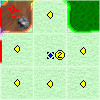

- в лесу, то если рядом с ней меньше 4 клеток леса, то доход 0, если меньше 8, то доход 1 и  доход 2, если вокруг 8 клеток леса (или 1/4 монеты за каждую клетку леса рядом, с округлением в меньшую сторону).

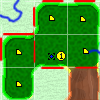

- в горах - приносит по одной монете с каждого построенного рудника рядом (начиная с медного)

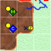 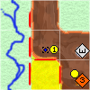

- в пустыне - не приносит дохода с соседних клеток

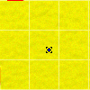

кроме того, если постройка была основана на клетке с рекой или берегу моря, в доход добавляется еще одна монета
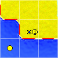 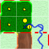 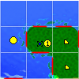 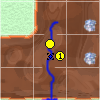 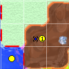 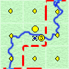 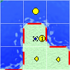
Таблица построек:

| Постройка | Стоимость | Доход/содержание | Количество вассальных Поселений |
| :-------- | :-------: | :--------------: | :-----------: |
| Поселение | 10        | 0                | 0             |
| Башня     | 25        | 1                | 1             | 
| Поместье  | 50        | 2                | 2             | 
| Замок     | 75        | 3                | 8             | 
| Город     | 75        | 3                | 0             | 
| Форт      | 25        | -3               | 0             | 
| Крепость  | 50        | -5               | 0             | 

**ПОСЕЛЕНИЕ** (не дом лорда) - минимальный уровень любой постройки. Может быть достроено до форта или башни.

**ДОМ ЛОРДА** - башня, поместье, замок, город.
На земле может быть только один дом лорда.
Помимо дохода с постройки, дом лорда позволяет собирать налоги с земли (налог с поселений на данной земле) в казну игрока. За каждое контролируемое или союзное поселение, ДЛ получает 1 монету дохода. Максимальное количество поселений ограничено по типу ДЛ.
Башня достраивается до поместья. Поместье может быть достроено до города или замка.

**ФОРТ** (не дом лорда) можно строить даже при наличии на земле дома лорда. Каждый Ваш форт увеличивает казну на 5 монет. Форт может быть достроен до Поместья или Крепости. Содержание 3 монеты.

**КРЕПОСТЬ** (не дом лорда) можно строить даже при наличии на земле дома лорда. Каждая Ваша крепость увеличивает казну на 10 монет. Крепость может быть достроена до Замка. Содержание 5 монет.

*Дерево построек*
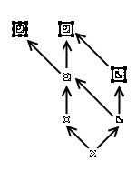

## 5.1 Повышение уровня (углубление).
За разницу стоимости уровней постройка становится на уровень выше. Если постройка может быть улучшена до нескольких типов, то игрок должен указать до какого именно. Для углубления рудника необходимо заплатить разницу стоимости между
открытым уровнем и открываемым. Вероятность удачного углубления 1/2.

## 5.2 Понижение на уровень
Бесплатно. Строение становится на уровень ниже. Если ниже некуда, то снимается с карты. ДЛ может быть понижено только до ДЛ или поселения.

# 50. Правила для отдельного модуля строений

## 50.1 Цель игры
Игра может проводится в отсутствие основных механик игры, т.е. без войск. В этом случае целью игры является накопление максимального количества денег за определенный период либо до наступления определенного события (Определяется регламентом, например, 20 лет или при достройке 10 ДЛ до города). Игрок начинает с 1 ДЛ + денег в казне в соответствии с регламентом.

## 50.2 Дополнительные действия 

### 50.2.1 Дополнительные действия игрока.
Игрок имеет следующие дополнительные действия (количество использования действий за ход определяется регламентом, по умолчанию, каждое действие доступно один раз за ход):

 #### 50.2.1.1 Вывод средств
  Перед игрой игроки решают какую сумму можно выводить за одно действие (по умолчанию 100 монет). Игрок в любой свой ход может вернуть данную сумму в банк игры и они будут учитываться при определении победителя.

 #### 50.2.1.2 Основание поселения (только для ДЛ)
  игрок пытается выставить поселение не далее 6 клеток по суше и не далее 10 клеток по морю от своего ближайшей постройки.

 #### 50.2.1.3 Основание шахтерского поселка/рудника (в зависимости от версии правил) 
  игрок пытается построить шахтерский поселок или рудник не далее 6 клеток по суше или по морю от ближайшей постройки.

### 50.2.2 Дополнительные действия строений.
Постройки имеют следующие активные действия:
 #### 50.2.2.2 Основание поселения
 ДЛ тратит АД на попытку выставить поселение не далее 4 клеток по суше и не далее 6 клеток по морю от себя.

 #### 50.2.2.3 Основание шахтерского поселка/рудника (в зависимости от версии правил) (только для построек)
 Постройка тратит АД на попытку построить шахтерский поселок или рудник не далее 3 клеток по суше или по морю от себя.

  ***Примечание:*** *путь по морю рассчитывается только при условии что постройка находится на реке или берегу моря. Если постройка на реке, то счет идет по ее руслу.*

## 50.3 Одновременная игра.
В случае одновременной игры все действия игроков по строительству выполняются одновременно и, в случае конфликта, все конфликтные действия не будут выполнены. Достройка поселения до ДЛ будет выполнена для того игрока у которого больше поселений на этой земле, иначе ни одна из достроек не будет выполнена.